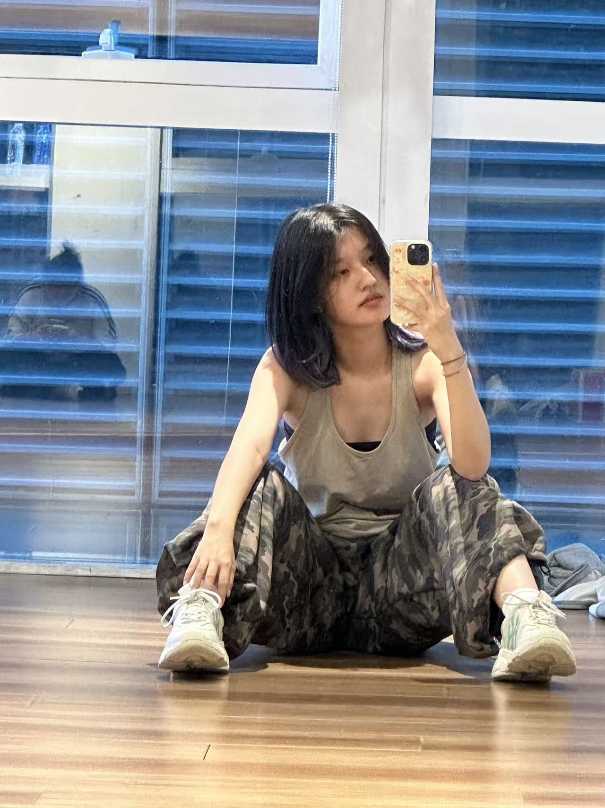
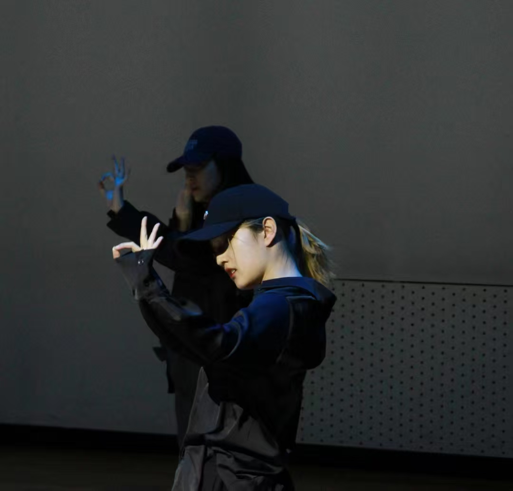
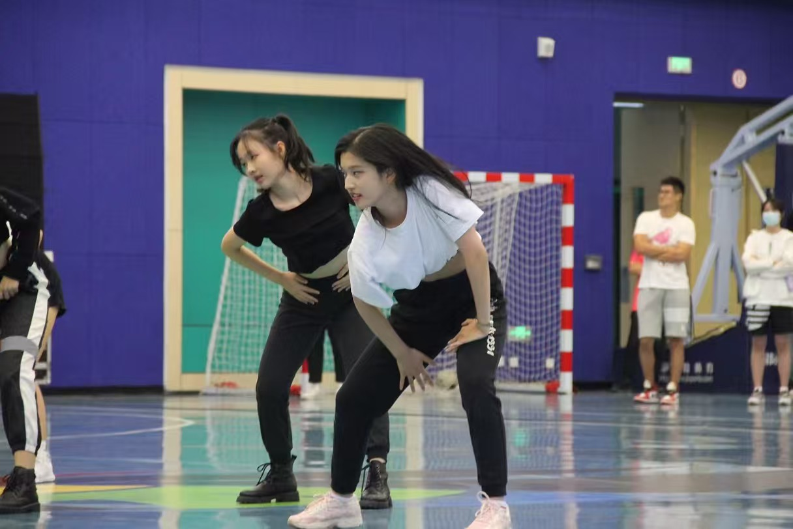
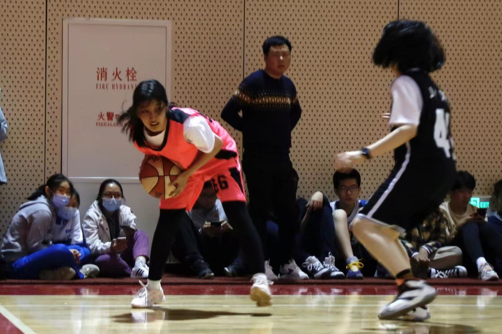
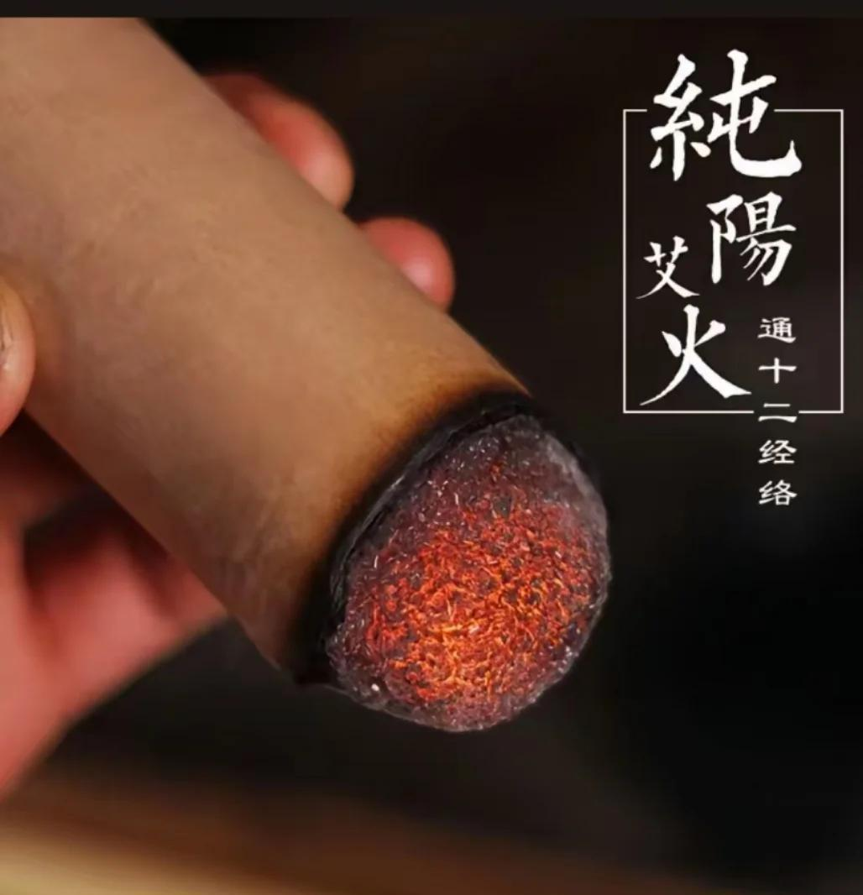

## Street Dancing
lalala i like dancing lalala

  
  
  

## Basketball
I was on the school basketball team in primary school, and served as the women’s basketball captain of my college house during high school.

  

## Traditional Chinses Medicine
wow it's not transformer CNN model, it's traditional chinese medicine

  

## Psychology
Engaged in long-term counseling for five years (no mental illness) and accumulated substantial psychology knowledge.

## Yoga
lalala yoga is tiring
